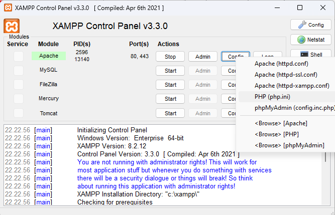
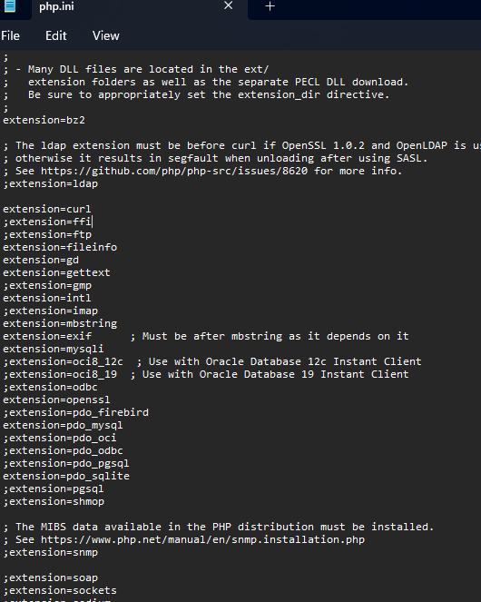
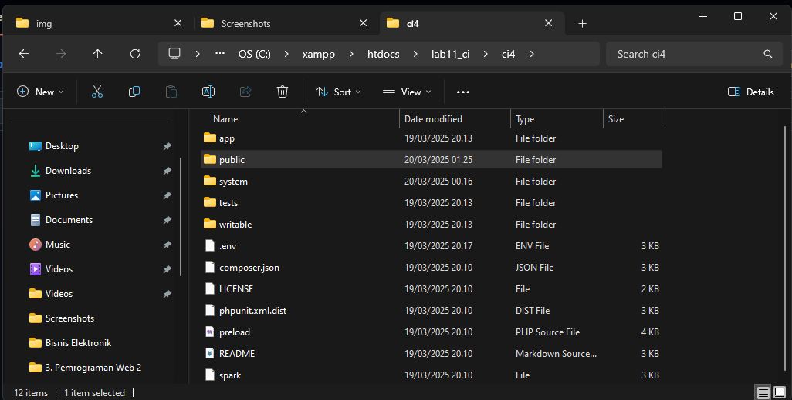
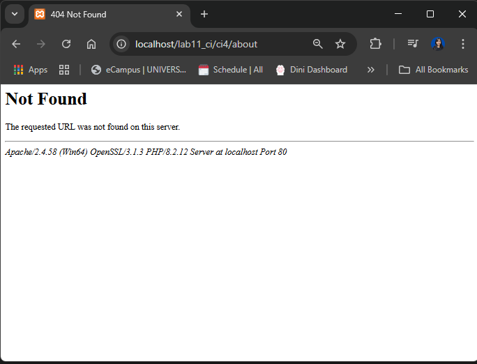
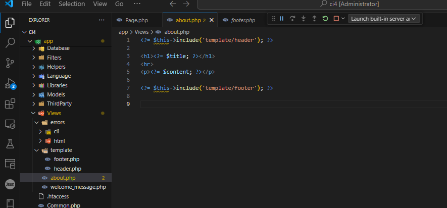

### Dini Ramadani | Universitas Pelita Banggsa


<h1 style="color: blue; font-size: 36px; text-align: center;">Praktikum 1 | PHP Framework (CodeIgniter)</h1>

<br>

## Persiapan :
Sebelum memulai menggunakan Framework Codeigniter, perlu dilakukan konfigurasi
pada webserver. Beberapa ekstensi PHP perlu diaktifkan untuk kebutuhan
pengembangan Codeigniter 4.
Berikut beberapa ekstensi yang perlu diaktifkan:
- php-json ekstension untuk bekerja dengan JSON;
- php-mysqlnd native driver untuk MySQL;
- php-xml ekstension untuk bekerja dengan XML;
- php-intl ekstensi untuk membuat aplikasi multibahasa;
- libcurl (opsional), jika ingin pakai Curl.

Untuk mengaktifkan ekstentsi tersebut, melalu XAMPP Control Panel, pada bagian
Apache klik ``Config -> PHP.ini``



Pada bagian extention, hilangkan tanda ; (titik koma) pada ekstensi yang akan
diaktifkan. Kemudian simpan kembali filenya dan restart Apache web server.



<br>

## Instalasi  Codeigniter 4
Langkah ini adalah proses instalasi framework Codeigniter 4 secara manual. Framework ini digunakan untuk mempermudah pengembangan aplikasi berbasis PHP. Untuk melakukan instalasi Codeigniter 4 dapat dilakukan dengan dua cara, yaitu cara manual dan menggunakan composer. Pada praktikum ini kita menggunakan cara manual.
- Unduh Codeigniter dari website https://codeigniter.com/download
- Extrak file zip Codeigniter ke direktori htdocs/lab11_ci.
- Ubah nama direktory framework-4.x.xx menjadi ci4.
- Buka browser dengan alamat http://localhost/lab11_ci/ci4/public/


<br>

## Menjalankan CLI (Command Line Interface)
Codeigniter 4 menyediakan CLI untuk mempermudah proses development. Untuk mengakses CLI buka terminal/command prompt.


Arahkan lokasi direktori sesuai dengan direktori kerja project dibuat ``(xampp/htdocs/lab11_ci/ci4/)``.

Perintah yang dapat dijalankan untuk memanggil CLI Codeigniter adalah :
```
php spark
```


<br>

## Mengaktifkan Mode Debugging
Mode debugging memungkinkan untuk melihat pesan error secara detail. 
- Ketik ``php spark serve`` pada CLI untuk menjalankan.


- Menampilkan pesan error, untuk mencobanya ubah kode file ``app/Controllers/home.php``, hapus ;nya.
  Ketik ``http://localhost:8080`` pada browser. Berikut tampilan error nya.


- Kemudian, ubah nama file ``env`` menjadi ``.env``. Masuk ke dalam filenya, hapus tanda ``#`` pada ``CI_ENVIRONMENT =``


<br>

## Struktur Direktori
Memahami struktur direktori Codeigniter sangat penting agar tahu di mana harus menyimpan file seperti controller, model, view, dan file statis.

📁 ``app/``
Direktori utama untuk pengembangan aplikasi. Di sinilah kamu akan menyimpan:
- ``app/Controllers/`` : berisi file PHP yang menangani permintaan (request) dari pengguna dan menentukan apa yang akan ditampilkan.
- ``app/Models/`` : untuk berinteraksi dengan database (CRUD).
- ``app/Views/``: berisi file tampilan (HTML/Blade) yang ditampilkan ke pengguna.
- ``Config/``: konfigurasi aplikasi seperti database, routes, dsb.
- ``Filters/``, ``Helpers/``, ``Libraries/``: Untuk fungsi tambahan.

📁 ``public/``
Ini adalah root direktori web server (dokumen publik).
- Berisi file index.php, gambar, CSS, JS, dan file statis lainnya.
- Kamu akan mengakses aplikasi dari sini (misalnya: localhost:8080/).
<em>Penting: Jangan letakkan file penting di sini karena bisa diakses publik!</em><br>

📁 ``system/``
Inti dari framework CodeIgniter.
- Berisi semua kode internal yang dibutuhkan untuk menjalankan CodeIgniter.
<em> Jangan ubah file di sini kecuali kamu tahu apa yang kamu lakukan.</em><br>

📁 ``test/``
Folder ini digunakan untuk testing aplikasi menggunakan PHPUnit.

📁 ``writable``
Folder untuk file yang perlu bisa ditulis sistem (write permission):
- ``cache/``: Penyimpanan cache sementara.
- ``logs/``: Catatan log error atau debugging.
- ``uploads/``: Tempat menyimpan file hasil upload (opsional).

📄 ``env``
File konfigurasi environment. Ubah nama menjadi ``.env`` untuk mengaktifkannya dan sesuaikan dengan kebutuhan, seperti konfigurasi database, mode development/production, dll.



<br>

## Routing and Controller
Routing digunakan untuk menentukan URL endpoint mana yang akan diarahkan ke controller tertentu. Controller menangani logika aplikasi dan menghubungkan antara model dan view.

Router terletak pada file ``app/config/Routes.php``

<br>

## Membuat Route Baru
Tambahkan kode berikut di dalam ``Routes.php``
```php
$routes->get('/about', 'Page::about');
$routes->get('/contact', 'Page::contact');
$routes->get('/faqs', 'Page::faqs');
```


Untuk mengetahui route yang ditambahkan sudah benar, buka CLI dan jalankan
perintah berikut.
```
php spark routes
```


Selanjutnya coba akses route yang telah dibuat dengan mengakses alamat url http://localhost:8080/about



<br>

## Membuat Controller
Selanjutnya adalah membuat Controller Page. Buat file baru dengan nama ``page.php`` pada direktori Controller kemudian isi kodenya seperti berikut.
```php
<?php
namespace App\Controllers;
class Page extends BaseController
{
    public function about()
    {
        echo "Ini halaman About";
    }

    public function contact()
    {
        echo "Ini halaman Contact";
    }

    public function faqs()
    {
        echo "Ini halaman FAQ";
    }
}
```

Selanjutnya refresh Kembali browser, maka akan ditampilkan hasilnya yaitu halaman sudah dapat diakses.


- Auto Routing
Secara default fitur autoroute pada Codeiginiter sudah aktif. Untuk mengubah status autoroute dapat mengubah nilai variabelnya. Untuk menonaktifkan ubah nilai ``true`` menjadi ``false``.
```php
$routes->setAutoRoute(true);
```


Tambahkan method baru pada Controller Page seperti berikut.
```php
public function tos()
{
    echo "ini halaman Term of Services";
}
```
Method ini belum ada pada routing, sehingga cara mengaksesnya dengan menggunakan alamat: http://localhost:8080/page/tos


<br>

## Membuat View
Selanjutnya adalah membuat view untuk tampilan web agar lebih menarik. Buat file baru dengan nama ``about.php`` pada direktori view ``(app/view/about.php)`` kemudian isi kodenya seperti berikut.
```php
<!DOCTYPE html>
<html lang="en">
    <head>
        <meta charset="UTF-8">
        <title><?= $title; ?></title>
    </head>
    <body>
        <h1><?= $title; ?></h1>
        <hr>
        <p><?= $content; ?></p>
    </body>
</html>
```


Ubah ``method about`` pada class ``Controller Page`` menjadi seperti berikut:
```php
public function about()
{
    return view('about', [
        'title' => 'Halaman About',
        'content' => 'Ini adalah halaman abaut yang menjelaskan tentang isi halaman ini.'
        ]);
}
```
Kemudian lakukan refresh pada halaman tersebut.


<br>

## Membuat Layout Web dengan CSS
Buat file css pada direktori ``public`` dengan nama ``style.css`` (copy file dari praktikum ``lab4_layout``. Kita akan gunakan layout yang pernah dibuat pada praktikum 4.


Kemudian buat folder template pada direktori view kemudian buat file ``header.php`` dan ``footer.php``
```php
<!DOCTYPE html>
<html lang="en">
<head>
    <meta charset="UTF-8">
    <title><?= $title; ?></title>
    <link rel="stylesheet" href="<?= base_url('/style.css');?>">
</head>
<body>
    <div id="container">
        <header>
            <h1>Layout Sederhana</h1>
        </header>
        <nav>
            <a href="<?= base_url('/');?>" class="active">Home</a>
            <a href="<?= base_url('/artikel');?>">Artikel</a>
            <a href="<?= base_url('/about');?>">About</a>
            <a href="<?= base_url('/contact');?>">Kontak</a>
        </nav>
        <section id="wrapper">
            <section id="main">
```


File ``app/view/template/footer.php``


Kemudian ubah file ``app/view/about.php`` seperti berikut.

```php
<?= $this->include('template/header'); ?>
<h1><?= $title; ?></h1>
<hr>
<p><?= $content; ?></p>
<?= $this->include('template/footer'); ?>
```


Selanjutnya refresh tampilan pada alamat http://localhost:8080/about


<br>

<br>

<div style="display: flex; justify-content: center; align-items: center; height: 100vh;">
  
</div>

