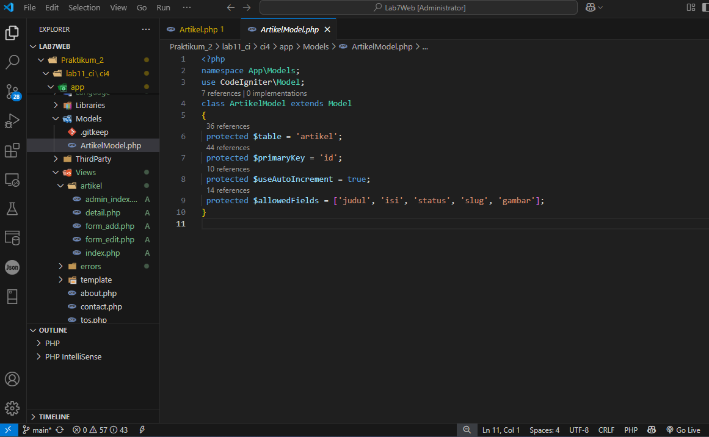
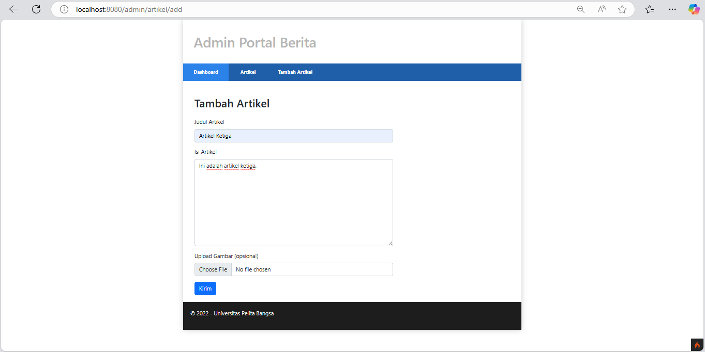
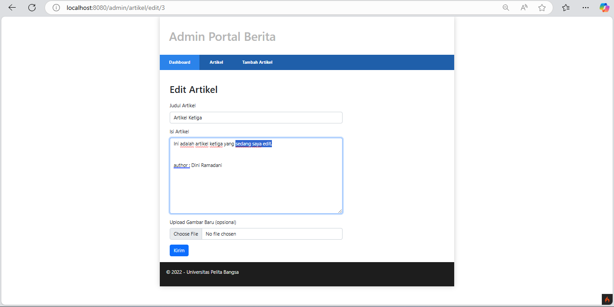
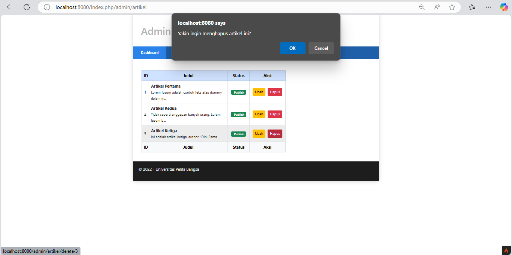
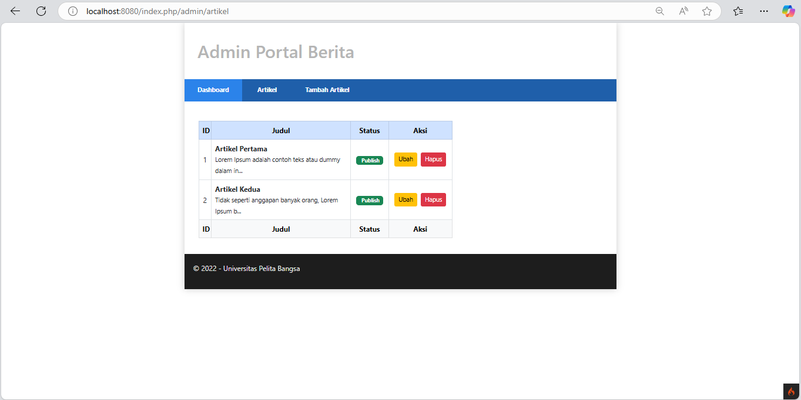

### Dini Ramadani | Universitas Pelita Bangsa

<h1 style="color: blue; font-size: 36px; text-align: center;">Praktikum 2 | Framework Lanjutan (CRUD)</h1>

<br>

## Persiapan :

Untuk memulai membuat aplikasi CRUD sederhana, yang perlu disiapkan adalah database server menggunakan MySQL. Pastikan MySQL Server sudah dapat dijalankan melalui XAMPP. XAMPP adalah perangkat lunak untuk menyediakan server lokal. Apache digunakan sebagai server web, dan MySQL digunakan sebagai server database untuk menyimpan data aplikasi CRUD.

<br>

## Membuat Database
Database adalah tempat penyimpanan data aplikasi. Tabel artikel dibuat menggunakan perintah ``SQL CREATE TABLE`` dengan kolom ``id``, ``judul``, ``isi``, ``gambar``, ``status``, dan ``slug``. Kolom id adalah primary key yang secara otomatis bertambah (auto_increment).
- Jalankan ``Apache, MySql`` pada Xampp, Buat database dengan nama ``lab_ci4`` di http://localhost/phpmyadmin.
- Buat tabel dengan nama ``artikel``.
  
    ```sql
    CREATE TABLE artikel (
        id INT(11) auto_increment,
        judul VARCHAR(200) NOT NULL,
        isi TEXT,
        gambar VARCHAR(200),
        status TINYINT(1) DEFAULT 0,
        slug VARCHAR(200),
        PRIMARY KEY(id)
    );
    ```
    

<br>

<br>

## Konfigurasi Koneksi Database
Selanjutnya membuat konfigurasi untuk menghubungkan dengan database server. Konfigurasi dapat dilakukan dengan dua acara, yaitu pada ``file app/config/database.php`` atau menggunakan  file ``.env``. File ``.env`` adalah file konfigurasi untuk menyimpan pengaturan seperti nama database, pengguna, dan kata sandi. Menghapus tanda # di depan konfigurasi database akan mengaktifkan pengaturan tersebut.

- Terletak di folder ``ci4``, file `.env`, Hapus tanda `#`.
<br>

<br>

<br>

## Membuat Model 
Selanjutnya adalah membuat Model untuk memproses data Artikel. Model adalah komponen yang bertugas untuk berinteraksi langsung dengan database. ArtikelModel digunakan untuk memproses data dari tabel artikel. Properti seperti ``$table`` menentukan nama tabel, dan ``$allowedFields`` menentukan kolom yang dapat diakses.
- Buat file baru pada direktori ``app/Models`` dengan nama ``ArtikelModel.php``
  
  ```php
  <?php
  namespace App\Models;
  use CodeIgniter\Model;
  class ArtikelModel extends Model
  {
  protected $table = 'artikel';
  protected $primaryKey = 'id';
  protected $useAutoIncrement = true;
  protected $allowedFields = ['judul', 'isi', 'status', 'slug', 'gambar'];
  }
  ```


<br>

<br>

## Membuat Controller
Controller adalah komponen yang mengatur logika aplikasi dan menghubungkan model dengan view. Fungsi ``index()`` memanggil semua data artikel dari model dan mengirimkannya ke view untuk ditampilkan.
- Buat Controller baru dengan nama ``Artikel.php`` pada direktori ``app/Controllers``.``

  ```php
  <?php
  namespace App\Controllers;
  use App\Models\ArtikelModel;
  class Artikel extends BaseController
  {
    public function index() 
    {
        $title = 'Daftar Artikel';
        $model = new ArtikelModel();
        $artikel = $model->findAll();
        return view('artikel/index', compact('artikel', 'title'));
    }
    }
  ```

<br>

<br>

## Membuat View pada artikel
View adalah bagian yang bertugas menampilkan data kepada pengguna dalam bentuk HTML. File ini menampilkan daftar artikel dengan struktur HTML dan menggunakan data yang dikirim dari controller.

- Buat direktori baru dengan nama ``artikel`` pada direktori ``app/views``, kemudian buat file baru dengan nama ``index.php``. 

  ```php
  <?= $this->include('template/header'); ?>
  <?php if($artikel): foreach($artikel as $row): ?>
  <article class="entry">
    <h2<a href="<?= base_url('/artikel/' . $row['slug']);?>"><?=
    $row['judul']; ?></a>
    </h2>
    " alt="<?=
    $row['judul']; ?>">
    <p><?= substr($row['isi'], 0, 200); ?></p>
  </article>
  <hr class="divider" />
  <?php endforeach; else: ?>
  <article class="entry">
    <h2>Belum ada data.</h2>
  </article>
  <?php endif; ?>
  <?= $this->include('template/footer'); ?>
  ```


<br>
- Selanjutnya buka browser kembali, dengan mengakses url http://localhost:8080/artikel
  

<br>

- Masukkan data ke tabel artikel,
  
    ```sql
    INSERT INTO artikel (judul, isi, slug) VALUE
    ('Artikel pertama', 'Lorem Ipsum adalah contoh teks atau dummy dalam industri percetakan dan penataan huruf atau typesetting. Lorem Ipsum telah menjadi standar contoh teks sejak tahun 1500an, saat seorang tukang cetak yang tidak dikenal mengambil sebuah kumpulan teks dan mengacaknya untuk menjadi sebuah buku contoh huruf.', 'artikel-pertama'), ('Artikel kedua', 'Tidak seperti anggapan banyak orang, Lorem Ipsum bukanlah 
    teks-teks yang diacak. Ia berakar dari sebuah naskah sastra latin klasik dari era 45 sebelum masehi, hingga bisa dipastikan usianya telah mencapai lebih dari 2000 tahun.', 'artikel-kedua');
    ```
    

<br>

- Refresh kembali browser.
  

<br>

<br>

## Membuat Tampilan detail Artikel
Tampilan pada saat judul berita di klik maka akan diarahkan ke halaman yang berbeda. 
- Terletak di folder `app/Controllers`, edit file `Artikel.php`. Tambah method ``view()``.
  
```php
public function view($slug)
    {
        $model = new ArtikelModel();
        $artikel = $model->where([
            'slug' => $slug
        ])->first();
        // Menampilkan error apabila data tidak ada.
        if (!$artikel) 
        {
            throw PageNotFoundException::forPageNotFound();
        }
        $title = $artikel['judul'];
        return view('artikel/detail', compact('artikel', 'title'));
    }
```
  

<br>

<br>

## Membuat View pada Detail
- Terletak di folder `app/Views/artikel`, buat file `detail.php`.
  
```php
<?= $this->include('template/header'); ?>

<article class="entry">
    <h2><?= $artikel['judul']; ?></h2>
    " alt="<?= $artikel['judul']; ?>">
    <p><?= $artikel['isi']; ?></p>
</article>

<?= $this->include('template/footer'); ?>
```
  

<br>

<br>

## Membuat Routing untuk artikel detail
- Terletak di folder `app/Config`, edit file `Routes.php`.
  
```php
$routes->get('/artikel/(:any)', 'Artikel::view/$1');
```
  

<br>

<br>

## Membuat Menu admin
- Terletak di folder `app/Controller`, edit file `Artikel.php`. Tambah method `admin_index()`.
  
```php
public function admin_index() 
    {
        $title = 'Daftar Artikel';
        $model = new ArtikelModel();
        $artikel = $model->findAll();
        return view('artikel/admin_index', compact('artikel', 'title'));
    }
```


<br>

- Selanjutnya, akses kembali folder `app/Views/artikel`, buat file `admin_index.php`.
  
    ```php
    <?= $this->include('template/admin_header'); ?>
    <table class="table table-bordered table-hover">
        <thead>
            <tr class="table-primary">
                <th scope="col">ID</th>
                <th scope="col">Judul</th>
                <th scope="col">Status</th>
                <th scope="col">Aksi</th>
            </tr>
        </thead>
        <tbody>
            <?php if($artikel): foreach($artikel as $row): ?>
            <tr>
                <td><?= $row['id']; ?></td>
                <td>
                    <b><?= $row['judul']; ?></b>
                    <p><small><?= substr($row['isi'], 0, 50); ?></small></p>
                </td>
                <td><?= $row['status']; ?></td>
                <td>
                    <a class="btn btn-primary p-1" href="<?= base_url('/admin/artikel/edit/' . 
                    $row['id']);?>">Ubah</a>
                    <a class="btn btn-danger p-1" onclick="return confirm('Yakin menghapus data?');" href="<?= base_url('/admin/artikel/delete/' . 
                    $row['id']);?>">Hapus</a>
                </td>
            </tr>
            <?php endforeach; else: ?>
            <tr>
                <td colspan="4">Belum ada data.</td>
            </tr>
            <?php endif; ?>
        </tbody>
        <tfoot>
            <tr class="table-primary">
                <th scope="col">ID</th>
                <th scope="col">Judul</th>
                <th scope="col">Status</th>
                <th scope="col">Aksi</th>
            </tr>
        </tfoot>
    </table>
    <?= $this->include('template/admin_footer'); ?>
    ```


<br>

- Buka folder yang ada di ``app/Views/artikel/template``, kemudian buat:
- ``admin_header.php``,
 ```php
 <!DOCTYPE html>
<html lang="en">
    <head>
        <meta charset="UTF-8">
        <title><?= $title; ?></title>
        <!-- CSS only -->
        <link rel="stylesheet" href="<?= base_url('/style.css');?>">
        <link href="https://cdn.jsdelivr.net/npm/bootstrap@5.2.0-beta1/dist/css/bootstrap.min.css" rel="stylesheet" integrity="sha384-0evHe/X+R7YkIZDRvuzKMRqM+OrBnVFBL6DOitfPri4tjfHxaWutUpFmBp4vmVor" crossorigin="anonymous">
    </head>
    <body>
        <div id="container">
            <header>
                <h1>Admin Portal Berita</h1>
            </header>
            <nav>
                <a href="<?= base_url('/admin_index');?>" class="active">Dashboard</a>
                <a href="<?= base_url('/artikel');?>">Artikel</a>
                <a href="<?= base_url('/add');?>">Tambah Artikel</a>
            </nav>
            <section id="wrapper">
                <section id="main">
```


<br>

- ``admin_footer.php``

  ```php
                  </section>
            </section>
            <footer>
                <p>&copy; 2022 - Universitas Pelita Bangsa</p>
            </footer>
        </div>
    </body>
  </html>
  ```


<br>

<br>

## Membuat Routing untuk menu admin
- Terletak di folder `app/Config`, edit file `Routes.php`.
  

<br>

- Akses browser dengan http://localhost:8080/admin/artikel.
  

<br>

<br>

## Menambah data untuk Artikel
- Terletak di folder `app/Controller`, edit file `Artikel.php`. Tambah method `add()`.

```php
public function add() 
    {
        // validasi data.
        $validation = \Config\Services::validation();
        $validation->setRules(['judul' => 'required']);
        $isDataValid = $validation->withRequest($this->request)->run();

        if ($isDataValid)
        {
            $artikel = new ArtikelModel();
            $artikel->insert([
                'judul' => $this->request->getPost('judul'),
                'isi' => $this->request->getPost('isi'),
                'slug' => url_title($this->request->getPost('judul')),
            ]);
            return redirect('admin/artikel');
        }
        $title = "Tambah Artikel";
        return view('artikel/form_add', compact('title'));
    }
```

<br>

- Akses kembali folder `app/Views/artikel`, buat file `form_add.php`.

```php
<?= $this->include('template/admin_header'); ?>

<h2><?= $title; ?></h2>

<form action="" method="post">
    <p><input type="text" name="judul" class="form-control" placeholder="Judul"></p>
    <p><textarea name="isi" cols="50" rows="10" class="form-control" placeholder="Isi"></textarea></p>
    <p>
        <input type="submit" value="Kirim" class="btn btn-primary btn-lg">
    </p>
</form>

<?= $this->include('template/admin_footer'); ?>
```


<br>

- Akses browser dengan http://localhost:8080/admin/artikel/add untuk membuat artikel ketiga, lalu `kirim`.


<br>

- Untuk mengeceknya ketik di url, http://localhost:8080/artikel kemudian enter.
  

<br>

<br>

## Mengubah data pada Artikel
- Terletak di folder `app/Controller`, edit file `Artikel.php`. Tambah method `edit()`.
```php
public function edit($id) 
    {
        $artikel = new ArtikelModel();

        // validasi data.
        $validation = \Config\Services::validation();
        $validation->setRules(['judul' => 'required']);
        $isDataValid = $validation->withRequest($this->request)->run();

        if ($isDataValid)
        {
            $artikel->update($id, [
                'judul' => $this->request->getPost('judul'),
                'isi' => $this->request->getPost('isi'),
            ]);
            return redirect('admin/artikel');
        }
        
        // ambil data lama
        $data = $artikel->where('id', $id)->first();
        $title = "Edit Artikel";
        return view('artikel/form_edit', compact('title', 'data'));
    }
```


<br>

- Akses kembali folder `app/Views/artikel`, buat file `form_edit.php`.
```php
<?= $this->include('template/admin_header'); ?>

<h2><?= $title; ?></h2>

<form action="" method="post">
    <p><input type="text" name="judul" class="form-control"  value="<?= $data['judul'];?>" ></p>
    <p>
        <textarea name="isi" id="isi" rows="10" style="width: 600px;" class="form-control"><?= $data['isi']; ?></textarea>
    </p>
    <p>
        <input type="submit" value="Kirim" class="btn btn-primary btn-lg">
    </p>
</form>

<?= $this->include('template/admin_footer'); ?>
```


<br>

- Akses browser dengan http://localhost:8080/admin/artikel/edit/1 untuk Mengubah artikel pertama.
  

<br>

<br>

## Menghapus data pada Artikel
- Terletak di folder `app/Controller`, edit file `Artikel.php`. Tambah method `delete()`.
```php
 public function delete($id) 
    {
        $artikel = new ArtikelModel();
        $artikel->delete($id);
        return redirect('admin/artikel');
    }
```


<br>

- Pergi ke menu admin untuk menghapusnya, http://localhost:8080/admin/artikel, kemudian pilih `hapus`.


<br>

- Artikel berhasil dihapus.
  


<div id="p13">


<br>

<br>

  <div class="centered">
    
  </div>
