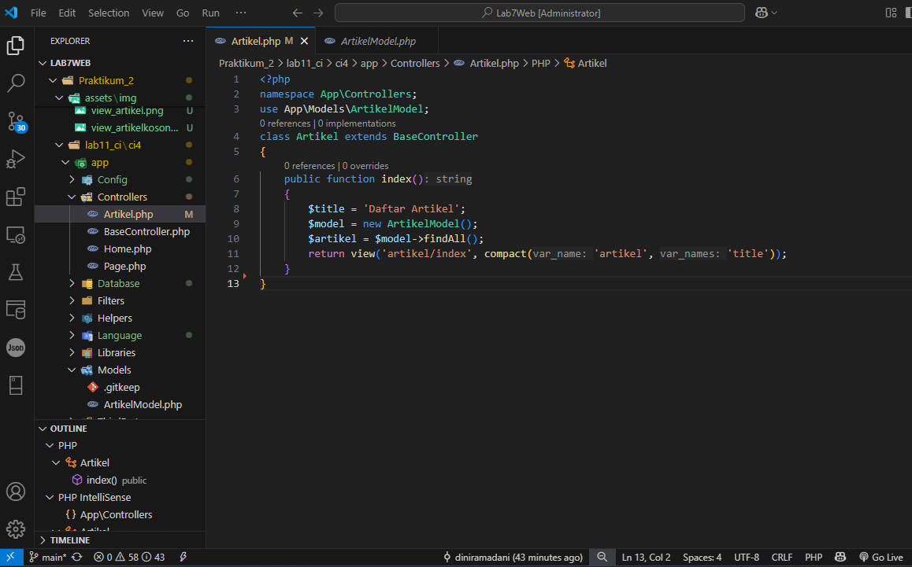
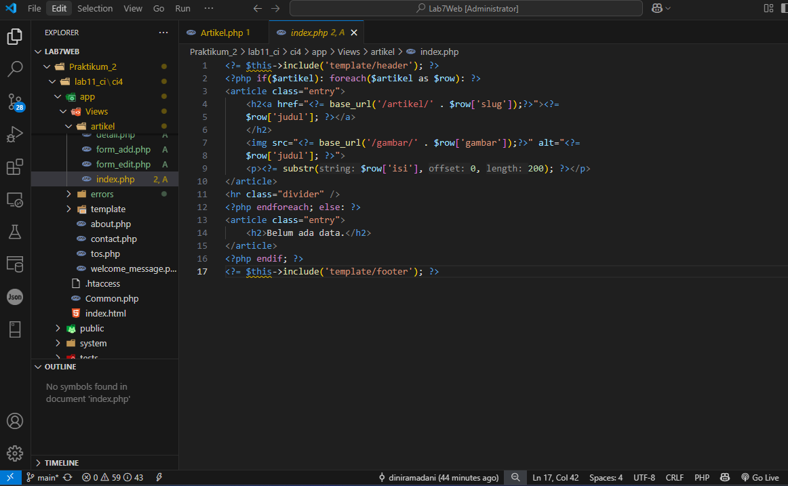

# <span style="color: blue">Praktikum 2 | Framework Lanjutan (CRUD)</span>

Persiapan.
Untuk memulai membuat aplikasi CRUD sederhana, yang perlu disiapkan adalah database server menggunakan MySQL. Pastikan MySQL Server sudah dapat dijalankan melalui XAMPP.

## 1. Membuat Database
- Jalankan ``Apache, MySql`` pada Xampp, Buat database dengan nama ``lab_ci4`` di http://localhost/phpmyadmin.
- Buat tabel dengan nama ``artikel``.
    ```sql
    CREATE TABLE artikel (
        id INT(11) auto_increment,
        judul VARCHAR(200) NOT NULL,
        isi TEXT,
        gambar VARCHAR(200),
        status TINYINT(1) DEFAULT 0,
        slug VARCHAR(200),
        PRIMARY KEY(id)
    );
    ```

<br>

## 2. Konfigurasi Koneksi Database
Selanjutnya membuat konfigurasi untuk menghubungkan dengan database server. Konfigurasi dapat dilakukan dengan du acara, yaitu pada file app/config/database.php atau menggunakan  file .env. 
- Terletak di folder ``ci4``, file `.env`, Hapus tanda `#`.

<br>

## 3. Membuat Model 
Selanjutnya adalah membuat Model untuk memproses data Artikel. Buat file baru pada direktori app/Models dengan nama ArtikelModel.php
- Terletak di folder `app/Models`, buat file `ArtikelModel.php`.

<br>

## 4. Membuat Controller 
Buat Controller baru dengan nama Artikel.php pada direktori app/Controllers.
- Terletak di folder `app/Controllers`, buat file `Artikel.php`.

<br>

## 5. Membuat View pada artikel 
Buat direktori baru dengan nama artikel pada direktori app/views, kemudian buat file baru dengan nama index.php. 
- Terletak di folder `app/Views/artikel`, buat file `index.php`.

<br>
- Selanjutnya buka browser kembali, dengan mengakses url http://localhost:8080/artikel

<br>

- Masukkan data ke tabel artikel,
    ```sql
    INSERT INTO artikel (judul, isi, slug) VALUE
    ('Artikel pertama', 'Lorem Ipsum adalah contoh teks atau dummy dalam industri 
    percetakan dan penataan huruf atau typesetting. Lorem Ipsum telah menjadi 
    standar contoh teks sejak tahun 1500an, saat seorang tukang cetak yang tidak 
    dikenal mengambil sebuah kumpulan teks dan mengacaknya untuk menjadi sebuah 
    buku contoh huruf.', 'artikel-pertama'), 
    ('Artikel kedua', 'Tidak seperti anggapan banyak orang, Lorem Ipsum bukanlah 
    teks-teks yang diacak. Ia berakar dari sebuah naskah sastra latin klasik dari 
    era 45 sebelum masehi, hingga bisa dipastikan usianya telah mencapai lebih 
    dari 2000 tahun.', 'artikel-kedua');
    ``` 

<br>

- Refresh kembali browser.

<br>

## 6. Membuat Tampilan detail Artikel
- Terletak di folder `app/Controllers`, edit file `Artikel.php`. Tambah method ``view()``.

<br>

## 7. Membuat View pada Detail
- Terletak di folder `app/Views/artikel`, buat file `detail.php`.

<br>

## 8. Membuat Routing untuk artikel detail
- Terletak di folder `app/Config`, edit file `Routes.php`.

<br>

- Klik `Artikel Kedua` pada http://localhost:8080/artikel, untuk pindah ke detailnya.

<br>

## 9. Membuat Menu admin
- Terletak di folder `app/Controller`, edit file `Artikel.php`. Tambah method `admin_index()`.

<br>

- Selanjutnya, akses kembali folder `app/Views/artikel`, buat file `admin_index.php`.
    ```php
    <?= $this->include('template/admin_header'); ?>
    <table class="table table-bordered table-hover">
        <thead>
            <tr class="table-primary">
                <th scope="col">ID</th>
                <th scope="col">Judul</th>
                <th scope="col">Status</th>
                <th scope="col">Aksi</th>
            </tr>
        </thead>
        <tbody>
            <?php if($artikel): foreach($artikel as $row): ?>
            <tr>
                <td><?= $row['id']; ?></td>
                <td>
                    <b><?= $row['judul']; ?></b>
                    <p><small><?= substr($row['isi'], 0, 50); ?></small></p>
                </td>
                <td><?= $row['status']; ?></td>
                <td>
                    <a class="btn btn-primary p-1" href="<?= base_url('/admin/artikel/edit/' . 
                    $row['id']);?>">Ubah</a>
                    <a class="btn btn-danger p-1" onclick="return confirm('Yakin menghapus data?');" href="<?= base_url('/admin/artikel/delete/' . 
                    $row['id']);?>">Hapus</a>
                </td>
            </tr>
            <?php endforeach; else: ?>
            <tr>
                <td colspan="4">Belum ada data.</td>
            </tr>
            <?php endif; ?>
        </tbody>
        <tfoot>
            <tr class="table-primary">
                <th scope="col">ID</th>
                <th scope="col">Judul</th>
                <th scope="col">Status</th>
                <th scope="col">Aksi</th>
            </tr>
        </tfoot>
    </table>
    <?= $this->include('template/admin_footer'); ?>
    ```
<br>

- Buka folder yang ada di ``app/Views/artikel/template``, kemudian buat:
- ``admin_header.php``,

<br>

- ``admin_footer.php``

<br>

## 10. Membuat Routing untuk menu admin
- Terletak di folder `app/Config`, edit file `Routes.php`.

<br>

- Akses browser dengan http://localhost:8080/admin/artikel.

<br>

## 11. Menambah data untuk Artikel
- Terletak di folder `app/Controller`, edit file `Artikel.php`. Tambah method `add()`.

<br>

- Akses kembali folder `app/Views/artikel`, buat file `form_add.php`.

<br>

- Akses browser dengan http://localhost:8080/admin/artikel/add.

<br>

## 12. Mengubah data pada Artikel
- Terletak di folder `app/Controller`, edit file `Artikel.php`. Tambah method `edit()`.

<br>

- Akses kembali folder `app/Views/artikel`, buat file `form_edit.php`.

<br>

- Akses browser dengan http://localhost:8080/admin/artikel/edit/1 untuk Mengubah artikel pertama.

<br>

## 13. Menghapus data pada Artikel
- Terletak di folder `app/Controller`, edit file `Artikel.php`. Tambah method `delete()`.

<br>

- Akses browser dengan http://localhost:8080/admin/artikel/add untuk membuat artikel ketiga, lalu `kirim`.

<br>

- Untuk mengeceknya ketik di url, http://localhost:8080/artikel kemudian enter.

<br>

- Pergi ke menu admin untuk menghapusnya, http://localhost:8080/admin/artikel, kemudian pilih `hapus`.

<br>

- Artikel berhasil dihapus.


<div id="p13">
