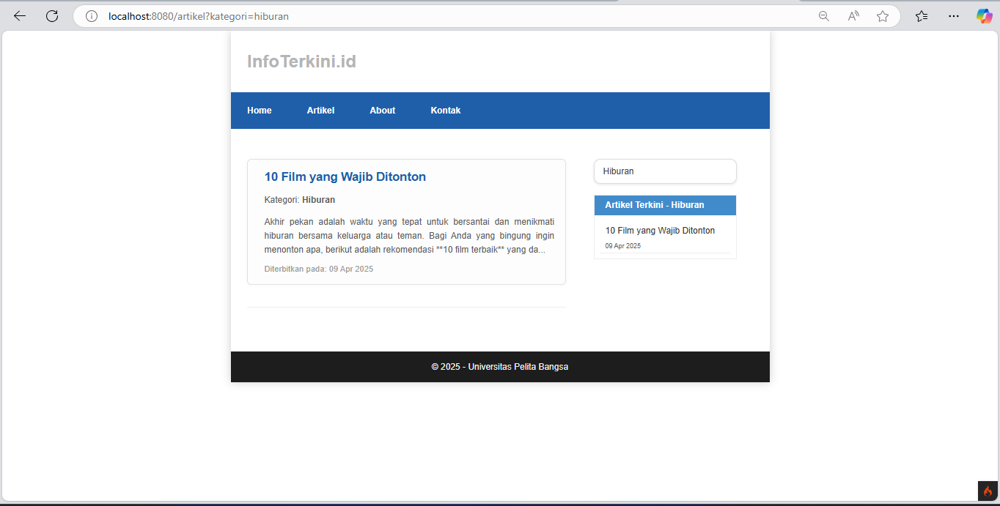
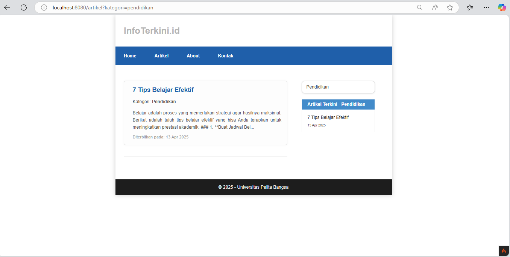

### Dini Ramadani | Universitas Pelita Bangsa

<h1 style="color: blue; font-size: 36px; text-align: center;">Praktikum 3 Part 2 | Menampilkan Artikel Berdasarkan Kategori</h1>
<br>

<div class="navbar">
  <h2>📚 Daftar Isi</h2>
  <ul class="toc-list">
    <li><a href="#pastikan-view-cell-mendukung-parameter-kategori">⚙️ Pastikan View Cell Mendukung Parameter Kategori</a></li>
    <li><a href="#pastikan-view-menampilkan-data-berdasarkan-kategori">🎨 Pastikan View Menampilkan Data Berdasarkan Kategori</a></li>
    <li><a href="#menambahkan-dropdown-untuk-memilih-kategori">⬇️ Menambahkan Dropdown untuk Memilih Kategori</a></li>
    <li><a href="#tampilan-view-cell-dengan-parameter-kategori">🔍 Tampilan View Cell Dengan Parameter Kategori</a></li>
  </ul>
</div>
<br>

Dalam pengembangan aplikasi berbasis PHP dengan framework seperti CodeIgniter, sering kali kita membutuhkan fitur dinamis untuk menampilkan data tertentu berdasarkan kategori yang dipilih oleh pengguna. Dalam praktikum ini, kita akan membahas langkah-langkah untuk membuat ``View Cell`` yang dapat menampilkan artikel terkini berdasarkan kategori yang diinginkan. ``View Cell`` adalah fitur yang sangat berguna untuk memisahkan logika kecil tertentu dari controller atau view utama. Dalam kasus ini, kita akan menggunakan View Cell untuk menampilkan artikel terkini berdasarkan kategori.

<br>

## Langkah-langkah Implementasi

### Pastikan View Cell Mendukung Parameter Kategori

Langkah pertama adalah memastikan bahwa ``View Cell`` mendukung parameter ``kategori``. Parameter ini akan digunakan untuk memfilter data artikel yang ditampilkan.

- Terletak di folder ``app/Cells``, edit file ``ArtikelTerkini.php``. Tambahkan parameter ``kategori``

```php 
name=ArtikelTerkini.php
<?php
namespace App\Cells;

use App\Models\ArtikelModel;

class ArtikelTerkini
{
    public function render($kategori = null)
    {
        $model = new ArtikelModel();
        $query = $model->orderBy('tanggal', 'DESC')->limit(5);


        if ($kategori) {
            $query->where('kategori', $kategori);
        }

        $artikel = $query->findAll();
        
        return view('components/artikel_terkini', [
            'artikel' => $artikel,
            'kategori' => $kategori,
        ]);
    }
}
```
<br>

### Pastikan ``View`` Menampilkan Data Berdasarkan Kategori

Selanjutnya, pastikan bahwa ``view`` yang digunakan oleh ``View Cell`` mendukung parameter ``kategori``.
- Terletak pada folder ``app/Views/components`` ubah file ``artikel_terkini.php``. 

```php 
<div class="widget-box">
    <h3 class="title">Artikel Terkini<?= $kategori ? ' - ' . ucfirst(esc($kategori)) : ''; ?></h3>
    <ul>
        <?php if (!empty($artikel)): ?>
            <?php foreach ($artikel as $item): ?>
                <li>
                    <a href="<?= site_url('artikel/' . $item['slug']) ?>">
                        <?= esc($item['judul']) ?>
                    </a>
                    <p><?= date('d M Y', strtotime($item['tanggal'])) ?></p>
                </li>
            <?php endforeach; ?>
        <?php else: ?>
            <p>Tidak ada artikel dalam kategori ini.</p>
        <?php endif; ?>
    </ul>
</div>
```

<br>

### Menambahkan Dropdown untuk Memilih Kategori

- Terletak pada folder ``app/Views/layout``, edit file ``main.php``.

```php
<section id="wrapper">
<section id="main">
  <?= $this->renderSection('content') ?>
</section>
  <aside id="sidebar">
    <form action="" method="get">
      <select name="kategori" onchange="this.form.submit()" class="form-select">
          <option value="">Semua Kategori</option>
          <option value="teknologi" <?= request()->getGet('kategori') === 'teknologi' ? 'selected' : ''; ?>>Teknologi</option>
          <option value="politik" <?= request()->getGet('kategori') === 'politik' ? 'selected' : ''; ?>>Politik</option>
          <option value="pendidikan" <?= request()->getGet('kategori') === 'pendidikan' ? 'selected' : ''; ?>>Pendidikan</option>
          <option value="hiburan" <?= request()->getGet('kategori') === 'hiburan' ? 'selected' : ''; ?>>Hiburan</option>
      </select>
    </form>
    <?= view_cell('App\\Cells\\ArtikelTerkini::render', ['kategori' => request()->getGet('kategori')]) ?>
  </aside>
</section>
```

<br>

### Tampilan ``View Cell`` Dengan Parameter ``kategori``.

- Page ``Artikel``


<br>

- Page ``Artikel`` dengan ``view cell`` pilihan kategori


<br>

- Page ``Artikel`` dengan kategori ``teknologi``


<br>

- Page ``Artikel`` dengan kategori ``hiburan``


<br>

- Page ``Artikel`` dengan kategori ``politik``


<br>

- Page ``Artikel`` dengan kategori ``pendidikan``


<br>

- Page ``Home``


<br>

- Page ``About``


<br>

- Page ``Kontak``


<br>

<br>

<div class="centered">
  
</div>