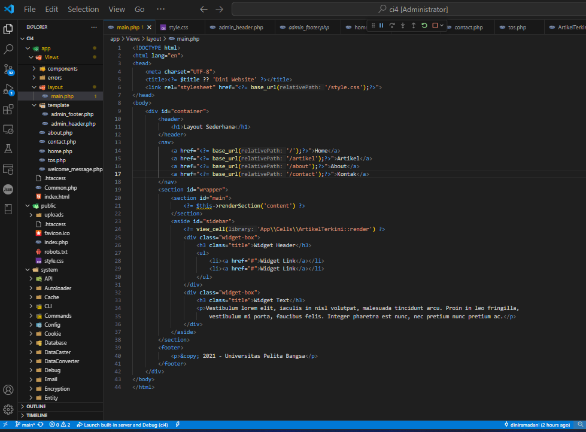
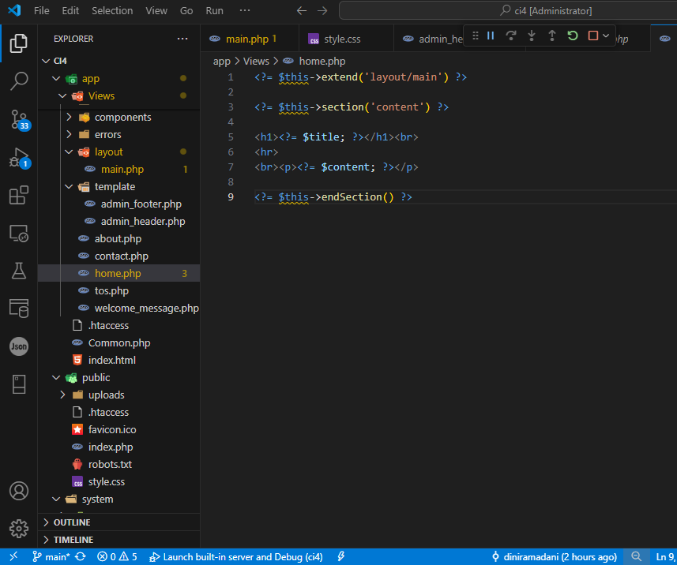
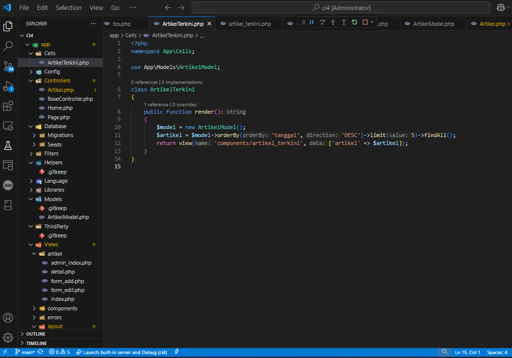
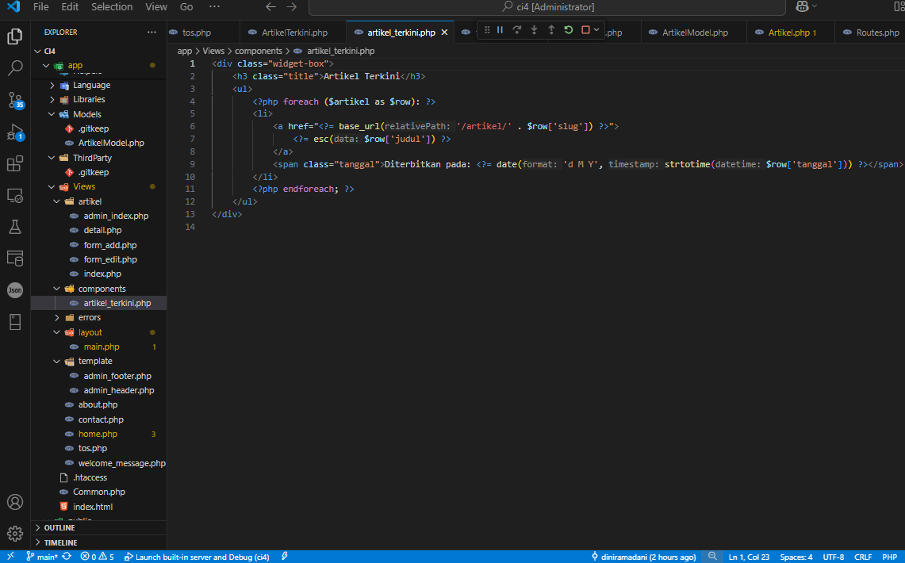
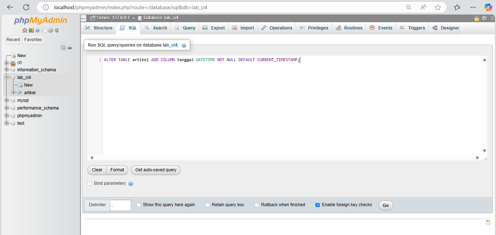
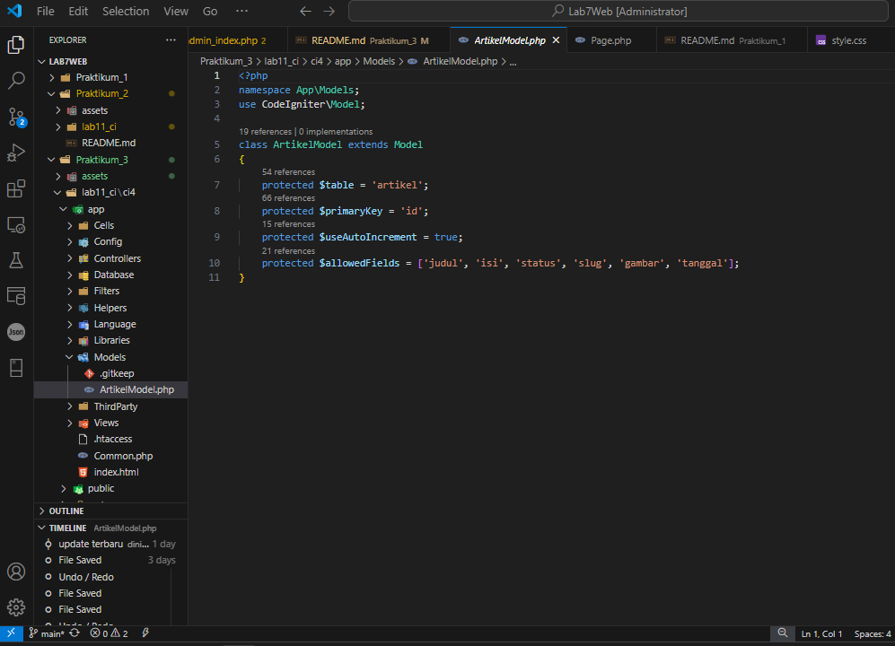
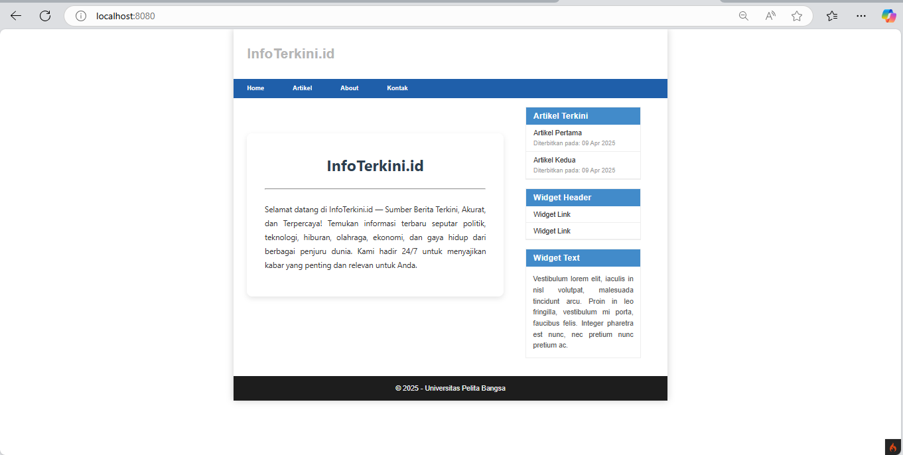
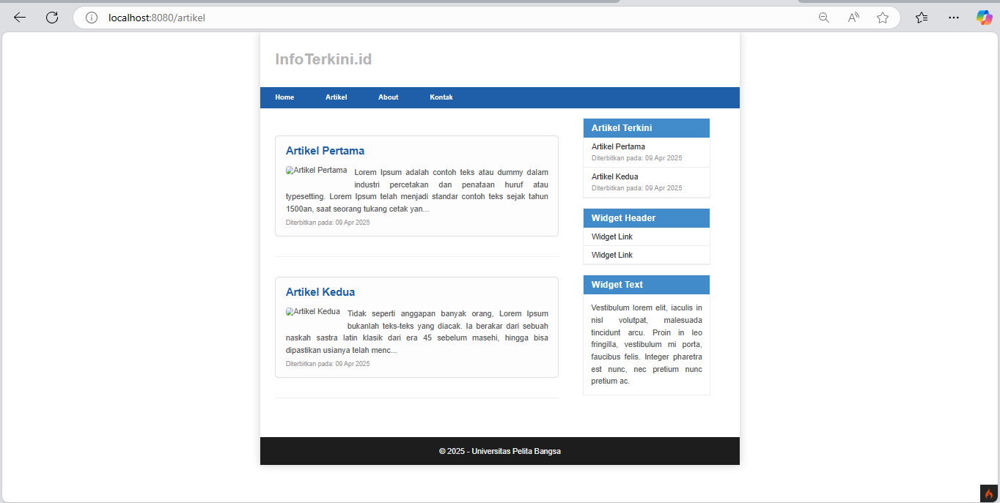
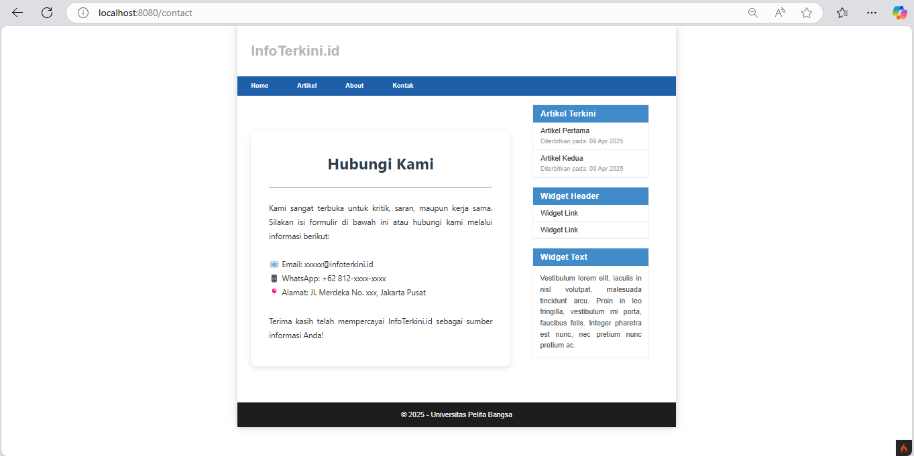
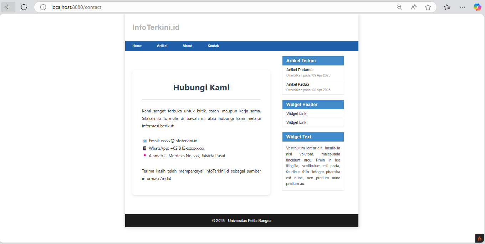

### Dini Ramadani | Universitas Pelita Bangsa

<h1 style="color: blue; font-size: 36px; text-align: center;">Praktikum 3 | View Layout dan View Cell</h1>

<br>

<div class="navbar">
  <h2>📚 Daftar Isi</h2>
  <ul class="toc-list">
    <li><a href="#persiapan">📌 Persiapan</a></li>
    <li><a href="#membuat-layout-utama">🗂️ Membuat Layout Utama</a></li>
    <li><a href="#membuat-file-view">📝 Membuat File View</a></li>
    <li><a href="#menampilkan-data-dinamis-dengan-view-cell">🔄 Menampilkan Data Dinamis dengan View Cell</a></li>
    <li><a href="#membuat-class-view-cell">🔧 Membuat Class View Cell</a></li>
    <li><a href="#membuat-view-untuk-view-cell">🖼️ Membuat View untuk View Cell</a></li>
    <li><a href="#menambahkan-field-tanggal">🕒 Menambahkan Field Tanggal</a></li>
    <li><a href="#perbarui-struktur-database">💾 Perbarui Struktur Database</a></li>
    <li><a href="#perbarui-model-artikel">🛠️ Perbarui Model Artikel</a></li>
    <li><a href="#tampilan-view-cell">🔲Tampilan View Cell</a></li>
  </ul>
</div>


<br>

## Persiapan :
Pada praktikum sebelumnya kita telah menggunakan template layout dengan konsep parsial atau memecah bagian template menjadi beberapa bagian untuk kemudian di include pada view yang lain. Praktikum kali ini kita akan mengunakan konsep View Layout dan View Cell untuk memudahkan dalam penggunaan layout.

<br>

## Membuat Layout Utama
- Buat folder ``layout`` di dalam ``app/Views/``.
- Buat file ``main.php`` di dalam folder ``layout`` dengan kode berikut :
  
    ```php
    <!DOCTYPE html>
    <html lang="en">
    <head>
        <meta charset="UTF-8">
        <title><?= $title ?? 'Dini Website' ?></title>
        <link rel="stylesheet" href="<?= base_url('/style.css');?>">
    </head>
    <body>
        <div id="container">
            <header>
                <h1>Layout Sederhana</h1>
            </header>
            <nav>
                <a href="<?= base_url('/');?>">Home</a>
                <a href="<?= base_url('/artikel');?>">Artikel</a>
                <a href="<?= base_url('/about');?>">About</a>
                <a href="<?= base_url('/contact');?>">Kontak</a>
            </nav>
            <section id="wrapper">
                <section id="main">
                    <?= $this->renderSection('content') ?>
                </section>
                <aside id="sidebar">
                    <?= view_cell('App\\Cells\\ArtikelTerkini::render') ?>
                    <div class="widget-box">
                        <h3 class="title">Widget Header</h3>
                        <ul>
                            <li><a href="#">Widget Link</a></li>
                            <li><a href="#">Widget Link</a></li>
                        </ul>
                    </div>
                    <div class="widget-box">
                        <h3 class="title">Widget Text</h3>
                        <p>Vestibulum lorem elit, iaculis in nisl volutpat, malesuada tincidunt arcu. Proin in leo fringilla, 
                            vestibulum mi porta, faucibus felis. Integer pharetra est nunc, nec pretium nunc pretium ac.</p>
                    </div>
                </aside>
            </section>
            <footer>
                <p>&copy; 2021 - Universitas Pelita Bangsa</p>
            </footer>
        </div>
    </body>
    </html>
    ```
    

<br>

<br>

## Membuat File View
- Ubah ``app/Views/home.php`` agar sesuai dengan layout baru :

```php
<?= $this->extend('layout/main') ?>
<?= $this->section('content') ?>

<h1><?= $title; ?></h1><br>
<hr>
<br><p><?= $content; ?></p>

<?= $this->endSection() ?>
```


<br>
Sesuaikan juga untuk halaman lainnya yang ingin menggunakan format layout yang baru.
<br>

## Menampilkan Data Dinamis dengan View Cell
View Cell adalah fitur yang memungkinkan pemanggilan tampilan dalam bentuk komponen yang dapat digunakan ulang. Cocok digunakan untuk elemen-elemen yang sering muncul di berbagai halaman seperti sidebar, widget, atau menu navigasi.


<br>

## Membuat Class View Cell
- Buat folder ``Cells`` di dalam ``app/``
- Buat file ``ArtikelTerkini.php`` di dalam ``app/Cells/`` dengan kode berikut:

```php
<?php
namespace App\Cells;

use App\Models\ArtikelModel;

class ArtikelTerkini
{
    public function render()
    {
        $model = new ArtikelModel();
        $artikel = $model->orderBy('tanggal', 'DESC')->limit(5)->findAll();
        return view('components/artikel_terkini', ['artikel' => $artikel]);
    }
}
```


<br>

<br>

## Membuat View untuk View Cell
- Buat folder ``components`` di dalam ``app/Views/``
- Buat file ``artikel_terkini.php`` di dalam ``app/Views/components/`` dengan kode berikut :

```php
<div class="widget-box">
    <h3 class="title">Artikel Terkini</h3>
    <ul>
        <?php foreach ($artikel as $row): ?>
        <li>
            <a href="<?= base_url('/artikel/' . $row['slug']) ?>">
                <?= esc($row['judul']) ?>
            </a>
            <span class="tanggal">Diterbitkan pada: <?= date('d M Y', strtotime($row['tanggal'])) ?></span>
        </li>
        <?php endforeach; ?>
    </ul>
</div>
```

<br>


<br>

<br>

## Menambahkan field Tanggal
Sesuaikan data dengan praktikum sebelumnya, perlu melakukan perubahan field pada database dengan menambahkan tanggal agar dapat mengambil data artikel terbaru.

<br>

## Perbarui Struktur Database
Langkah ini bertujuan untuk menambahkan kolom baru ke dalam tabel artikel di database Anda. Kolom tersebut akan menyimpan data tanggal dalam format ``DATETIME``.

```sql
ALTER TABLE artikel ADD COLUMN tanggal DATETIME NOT NULL DEFAULT CURRENT_TIMESTAMP;
```

<br>


<br>

<br>

## Perbarui Model Artikel
Setelah struktur tabel diperbarui, Anda perlu memastikan bahwa model ``ArtikelModel`` yang digunakan dalam aplikasi telah diperbarui untuk mendukung kolom baru ini. 
- Terletak pada ``app/Models/`` ubah file ``ArtikelModel.php``.

```php
<?php
namespace App\Models;
use CodeIgniter\Model;

class ArtikelModel extends Model
{
    protected $table = 'artikel';
    protected $primaryKey = 'id';
    protected $useAutoIncrement = true;
    protected $allowedFields = ['judul', 'isi', 'status', 'slug', 'gambar', 'tanggal'];
}
```

<br>


<br>


## View Cell
Berikut adalah tampilan ``View Cell`` di setiap halaman. Komponen ``Artikel Terkin``i`` ditampilkan di sisi kanan layout pada seluruh halaman, lengkap dengan tanggal publikasinya."

- Page ``Home``
<br>


<br>

- Page ``Artikel``
<br>


<br>

- Page ``About``
<br>


<br>

- Page ``Kontak``
<br>


<br>