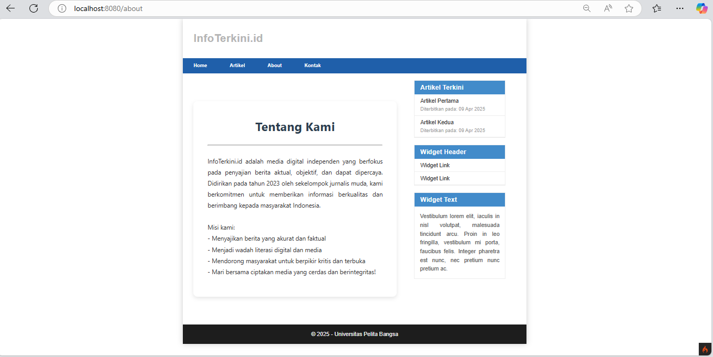

### Dini Ramadani | Universitas Pelita Bangsa

<h1 style="color: blue; font-size: 36px; text-align: center;">Praktikum 3 | View Layout dan View Cell</h1>

<br>

<div class="navbar">
  <h2>📚 Daftar Isi</h2>
  <ul class="toc-list">
    <li><a href="#persiapan">📌 Persiapan</a></li>
    <li><a href="#membuat-layout-utama">🗂️ Membuat Layout Utama</a></li>
    <li><a href="#membuat-file-view">📝 Membuat File View</a></li>
    <li><a href="#membuat-class-view-cell">🔧 Membuat Class View Cell</a></li>
    <li><a href="#membuat-view-untuk-view-cell">🖼️ Membuat View untuk View Cell</a></li>
    <li><a href="#view-cell">🔲 View Cell</a></li>
  </ul>
</div>


<br>

## Persiapan :
Pada praktikum sebelumnya kita telah menggunakan template layout dengan konsep parsial atau memecah bagian template menjadi beberapa bagian untuk kemudian di include pada view yang lain. Praktikum kali ini kita akan mengunakan konsep View Layout dan View Cell untuk memudahkan dalam penggunaan layout.

<br>

## Membuat Layout Utama
- Buat folder ``layout`` di dalam ``app/Views/``.
- Buat file ``main.php`` di dalam folder ``layout`` dengan kode berikut :
  
    ```php
    <!DOCTYPE html>
    <html lang="en">
    <head>
        <meta charset="UTF-8">
        <title><?= $title ?? 'Dini Website' ?></title>
        <link rel="stylesheet" href="<?= base_url('/style.css');?>">
    </head>
    <body>
        <div id="container">
            <header>
                <h1>Layout Sederhana</h1>
            </header>
            <nav>
                <a href="<?= base_url('/');?>">Home</a>
                <a href="<?= base_url('/artikel');?>">Artikel</a>
                <a href="<?= base_url('/about');?>">About</a>
                <a href="<?= base_url('/contact');?>">Kontak</a>
            </nav>
            <section id="wrapper">
                <section id="main">
                    <?= $this->renderSection('content') ?>
                </section>
                <aside id="sidebar">
                    <?= view_cell('App\\Cells\\ArtikelTerkini::render') ?>
                    <div class="widget-box">
                        <h3 class="title">Widget Header</h3>
                        <ul>
                            <li><a href="#">Widget Link</a></li>
                            <li><a href="#">Widget Link</a></li>
                        </ul>
                    </div>
                    <div class="widget-box">
                        <h3 class="title">Widget Text</h3>
                        <p>Vestibulum lorem elit, iaculis in nisl volutpat, malesuada tincidunt arcu. Proin in leo fringilla, 
                            vestibulum mi porta, faucibus felis. Integer pharetra est nunc, nec pretium nunc pretium ac.</p>
                    </div>
                </aside>
            </section>
            <footer>
                <p>&copy; 2021 - Universitas Pelita Bangsa</p>
            </footer>
        </div>
    </body>
    </html>
    ```
    

<br>

<br>

## Membuat File View
- Ubah ``app/Views/home.php`` agagr sesuai dengan layout baru :

```php
<?= $this->extend('layout/main') ?>
<?= $this->section('content') ?>

<h1><?= $title; ?></h1><br>
<hr>
<br><p><?= $content; ?></p>

<?= $this->endSection() ?>
```


<br>

<br>

## Membuat Class View Cell
- Buat folder ``Cells`` di dalam ``app/``
- Buat file ``ArtikelTerkini.php`` di dalam ``app/Cells/`` dengan kode berikut:

```php
<?php
namespace App\Cells;

use App\Models\ArtikelModel;

class ArtikelTerkini
{
    public function render()
    {
        $model = new ArtikelModel();
        $artikel = $model->orderBy('tanggal', 'DESC')->limit(5)->findAll();
        return view('components/artikel_terkini', ['artikel' => $artikel]);
    }
}
```


<br>

<br>

## Membuat View untuk View Cell
- Buat folder ``components`` di dalam ``app/Views/``
- Buat file ``artikel_terkini.php`` di dalam ``app/Views/components/`` dengan kode berikut :

```php
<div class="widget-box">
    <h3 class="title">Artikel Terkini</h3>
    <ul>
        <?php foreach ($artikel as $row): ?>
        <li>
            <a href="<?= base_url('/artikel/' . $row['slug']) ?>">
                <?= esc($row['judul']) ?>
            </a>
            <span class="tanggal">Diterbitkan pada: <?= date('d M Y', strtotime($row['tanggal'])) ?></span>
        </li>
        <?php endforeach; ?>
    </ul>
</div>
```

<br>

<br>

<br>

## View Cell
Berikut adalah tampilan ``view cells`` di setiap page.

- Page ``Home``
<br>


<br>

- Page ``Artikel``
<br>


<br>

- Page ``About``
<br>


<br>

- Page ``Kontak``
<br>


<br>