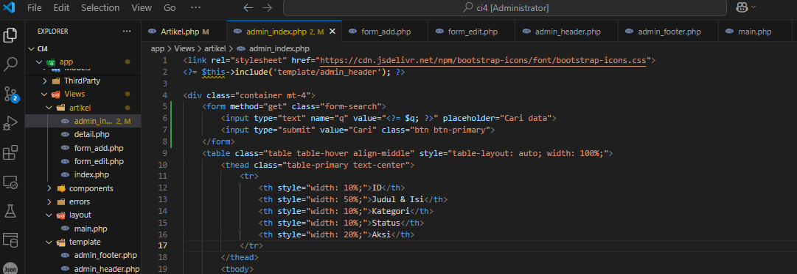
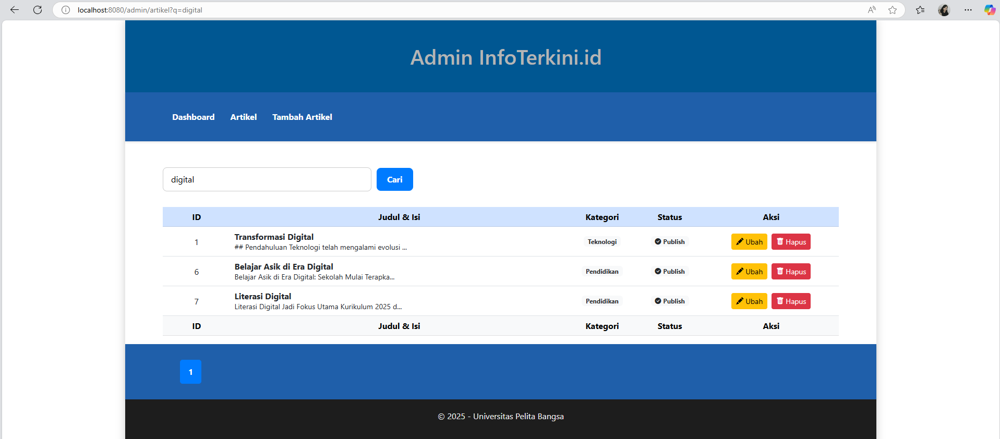

### Dini Ramadani | Universitas Pelita Bangsa

<h1 style="color: blue; font-size: 36px; text-align: center;">Praktikum 5 | Pagination dan Pencarian</h1>
<br>

## 📚 Daftar Isi
1. [Pendahuluan](#pendahuluan)
2. [Langkah-langkah Praktikum](#langkah-langkah-praktikum)
   - [Membuat Pagination](#membuat-pagination)
   - [Membuat Pencarian](#membuat-pencarian)
3. [Hasil Uji Coba](#hasil-uji-coba)
4. [Kesimpulan](#kesimpulan)

<br>

## Pendahuluan
Pada praktikum ini, kita akan mempelajari cara membuat **Pagination** dan **Pencarian** menggunakan framework CodeIgniter 4. Pagination digunakan untuk membatasi tampilan data yang panjang dengan membaginya ke dalam beberapa halaman, sedangkan pencarian digunakan untuk memfilter data berdasarkan kata kunci tertentu.

<br>

## Langkah-langkah Praktikum

### Membuat Pagination
Pagination merupakan proses yang digunakan untuk membatasi tampilan data yang panjang pada sebuah website. Pada CodeIgniter 4, fungsi pagination sudah tersedia pada Library sehingga cukup mudah untuk digunakan.

#### 1. Modifikasi Controller
Buka kembali `Controller Artikel`, kemudian modifikasi kode pada method `admin_index` seperti berikut:

```php
public function admin_index()
{
    $title = 'Daftar Artikel';
    $model = new ArtikelModel();
    $data = [
        'title' => $title,
        'artikel' => $model->paginate(10),
        'pager' => $model->pager,
    ];

    return view('artikel/admin_index', $data);
}
```

#### 2. Tambahkan Pagination di View
Buka file `views/artikel/admin_index.php` dan tambahkan kode berikut di bawah deklarasi tabel data:

```php
<?= $pager->links(); ?>
```

#### 3. Uji Coba Pagination
Buka kembali menu daftar artikel, tambahkan data lagi untuk melihat hasilnya.

<br>

### Membuat Pencarian
Pencarian data digunakan untuk memfilter data berdasarkan kata kunci tertentu.

#### 1. Modifikasi Controller
Buka kembali `Controller Artikel`, pada method `admin_index` ubah kodenya seperti berikut:

```php
public function admin_index()
{
    $title = 'Daftar Artikel';
    $q = $this->request->getVar('q') ?? '';
    $model = new ArtikelModel();
    $data = [
        'title' => $title,
        'q' => $q,
        'artikel' => $model->like('judul', $q)->paginate(10),
        'pager' => $model->pager,
    ];

    return view('artikel/admin_index', $data);
}
```

#### 2. Tambahkan Form Pencarian di View
Buka kembali file `views/artikel/admin_index.php` dan tambahkan form pencarian sebelum deklarasi tabel seperti berikut:

```php
<form method="get" class="form-search">
  <input type="text" name="q" value="<?= $q; ?>" placeholder="Cari data">
  <input type="submit" value="Cari" class="btn btn-primary">
</form>
```

#### 3. Modifikasi Link Pager
Pada link pager, ubah seperti berikut:

```php
<?= $pager->only(['q'])->links(); ?>
```

<br>

## Hasil Uji Coba
Berikut adalah hasil uji coba dari implementasi pagination dan pencarian:

1. **Tampilan Pagination**  
   

2. **Form Pencarian**  
   

3. **Hasil Pencarian**  
   

<br>


<div class="centered">
  
</div>