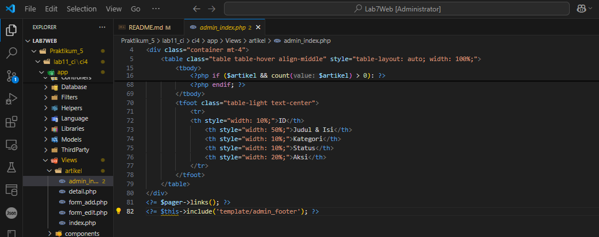

### Dini Ramadani | Universitas Pelita Bangsa

<h1 style="color: blue; font-size: 36px; text-align: center;">Praktikum 5 | Pagination Dan Pencarian</h1>
<br>

<div class="navbar">
  <h2>📚 Daftar Isi</h2>
  <ul class="toc-list">
  </ul>
</div>

<br>

## Langkah-langkah Praktikum


## Membuat Pagination
Pagination merupakan proses yang digunakan untuk membatasi tampilan yang panjang dari data yang banyak pada sebuah website. Fungsi pagination adalah memecah tampilan menjadi beberapa halaman tergantung banyaknya data yang akan ditampilkan pada setiap halaman. Pada Codeigniter 4, fungsi pagination sudah tersedia pada Library sehingga cukup mudah menggunakannya.

<br>
Untuk membuat pagination, buka Kembali ``Controller Artikel``, kemudian modifikasi kode pada method ``admin_index`` seperti berikut.

```php
   public function admin_index()
    {
        $title = 'Daftar Artikel';
        $model = new ArtikelModel();
        $data = [
            'title' => $title,
            'artikel' => $model->paginate(10),
            'pager' => $model->pager,
        ];

        return view('artikel/admin_index', $data);
    }
```

<br>

<br>

Kemudian buka file ``views/artikel/admin_index.php`` dan tambahkan kode berikut dibawah deklarasi tabel data.

```php
<?= $pager->links(); ?>
```


<br>


<br>
Selanjutnya buka kembali menu daftar artikel, tambahkan data lagi untuk melihat hasilnya.


<br>

<br>

## Membuat Pencarian
Pencarian data digunakan untuk memfilter data. Untuk membuat pencarian data, buka kembali ``Controller Artikel``, pada method ``admin_index`` ubah kodenya seperti berikut

```php

```


<br>

<br>

Kemudian buka kembali file ``views/artikel/admin_index.php`` dan tambahkan form pencarian sebelum deklarasi tabel seperti berikut:

```php

```


<br>

<br>

Dan pada link pager ubah seperti berikut.

```php
<?= $pager->only(['q'])->links(); ?>
```


<br>


<br>

Selanjutnya ujicoba dengan membuka kembali halaman admin artikel, masukkan kata unci tertentu pada form pencarian.


<br>

<br>

<br>


<br>

  <div class="centered">
    
  </div>